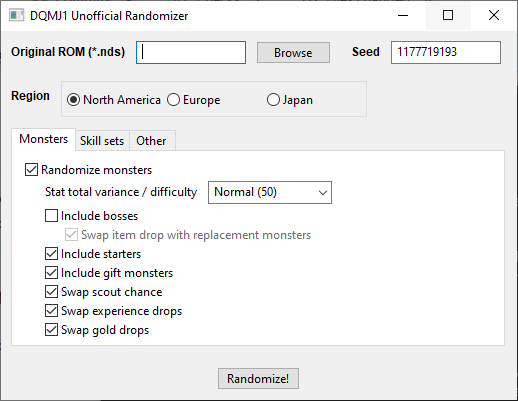

# DQMJ1 Unofficial Randomizer
An unofficial randomizer for *Dragon Quest Monsters: Joker 1* for the Nintendo DS.



## Download
Download the latest release of DQMJ1 Unofficial Randomizer for your operating system at the link below:

https://github.com/ExcaliburZero/dqmj1_randomizer/releases

## Development
### Download source code
```bash
# Download the source code
git clone https://github.com/ExcaliburZero/dqmj1_randomizer.git
cd dqmj1_randomizer
```

### Setup conda environment
For building and running the program from source, I recommend using Conda (ex. through [miniforge](https://conda-forge.org/miniforge/)). Conda will manage installing the correct Python version for you.

```bash
# Install miniforge by downloading and running the installer for your OS listed at the link below
#
#   https://conda-forge.org/miniforge/

# Create conda environment
conda env create -f dqmj1_randomizer.yml

# Activate the conda environment (each time you open a new terminal window)
conda activate dqmj1_randomizer
```

### Building executable 
```bash
# Install the library
pip install -e .

# Create the executable
make compile
```

### Testing without building executable (faster)
```bash
# Install the library
pip install -e .

# Run the program
python dqmj1_randomizer/main.py
```